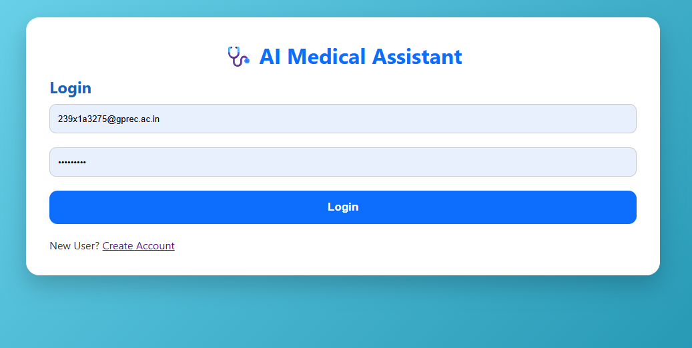
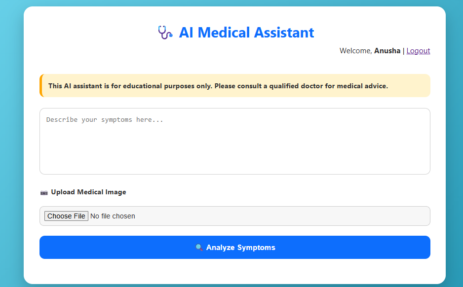
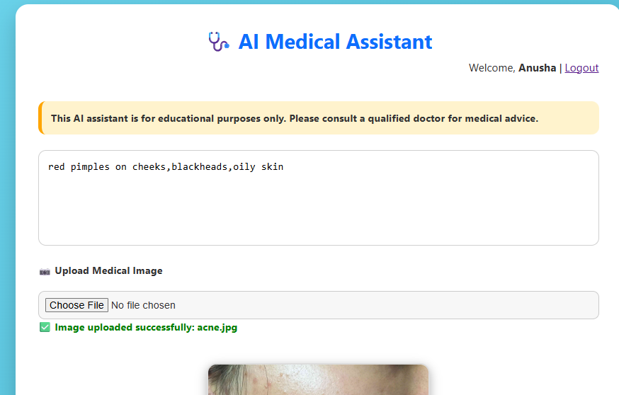
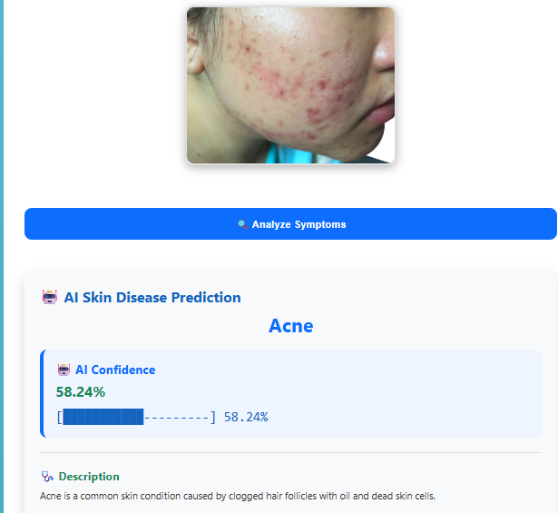
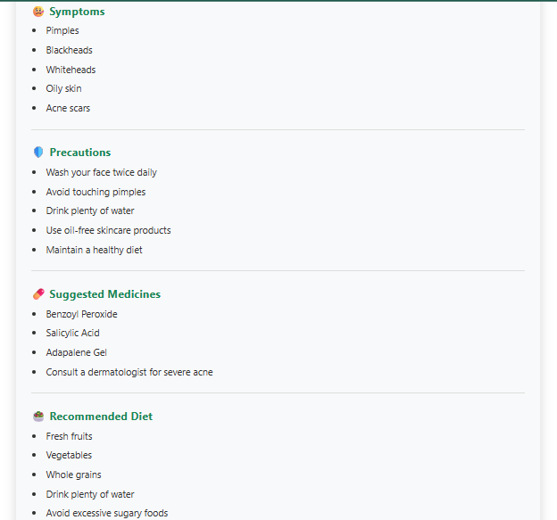
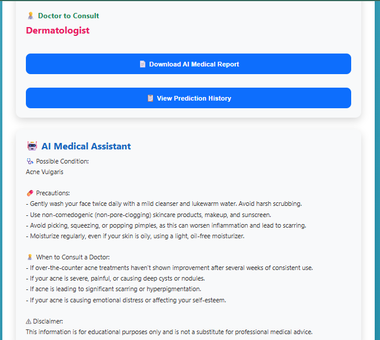
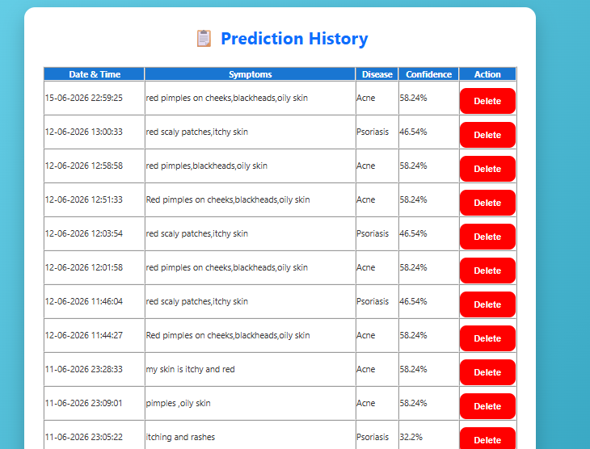
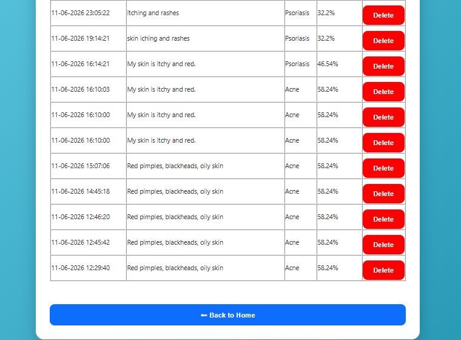

# 🩺 AI Medical Assistant

An AI-powered Medical Assistant web application developed using **Flask, TensorFlow, SQLite, and Google's Gemini AI**. This application helps users analyze symptoms, predict skin diseases from uploaded images, receive AI-generated medical guidance, download medical reports, and maintain prediction history.

---

## 🚀 Features

- 🔐 User Login & Registration
- 📝 Symptom Analysis
- 📷 Skin Disease Detection using Deep Learning
- 🤖 AI Medical Assistant powered by Gemini AI
- 📄 Download AI Medical Report (PDF)
- 📋 Prediction History
- 💾 SQLite Database Integration
- 🎨 Clean and Responsive User Interface

---

## 🛠️ Technologies Used

- Python
- Flask
- TensorFlow
- Keras
- SQLite
- HTML
- CSS
- JavaScript
- Google Gemini AI API

---

## 📂 Project Structure

```
AI-Medical-Assistant/
│
├── app.py
├── database.py
├── disease_info.py
├── gemini_ai.py
├── pdf_report.py
├── skin_model.py
├── requirements.txt
│
├── templates/
│     ├── index.html
│     ├── login.html
│     ├── register.html
│     └── history.html
│
├── static/
│     └── style.css
│
└── skin_disease_model.h5
```

---

## ⚙️ Installation

Clone the repository

```bash
git clone https://github.com/perumallaanusha/AI-Medical-Assistant.git
```

Move into the project

```bash
cd AI-Medical-Assistant
```

Create Virtual Environment

```bash
python -m venv venv
```

Activate Virtual Environment

Windows

```bash
venv\Scripts\activate
```

Install Dependencies

```bash
pip install -r requirements.txt
```

Run the Application

```bash
python app.py
```

Open

```
http://127.0.0.1:5000
```

---

## 💡 How It Works

1. User logs into the application.
2. Enter symptoms manually.
3. Upload a skin image (optional).
4. TensorFlow model predicts the skin disease.
5. Gemini AI explains the disease in simple language.
6. User can download the medical report.
7. All predictions are stored in prediction history.

---

## 📌 Future Improvements

- Dark Mode
- Interactive Dashboard
- Multi-language Support
- Doctor Recommendation System
- Voice-based Medical Assistant
- Cloud Deployment

---

## 👩‍💻 Author

**Perumalla Anusha**

B.Tech Student

G. Pulla Reddy Engineering College

---

## ⚠️ Disclaimer

This project is developed for educational purposes only.

It is **NOT** intended to replace professional medical advice. Always consult a qualified healthcare professional.

---

# 📸 Application Screenshots

## 🔐 Login Page



---

## 🏠 Home Page



---

## 🤖 Skin Disease Prediction









---

## 📋 Prediction History




